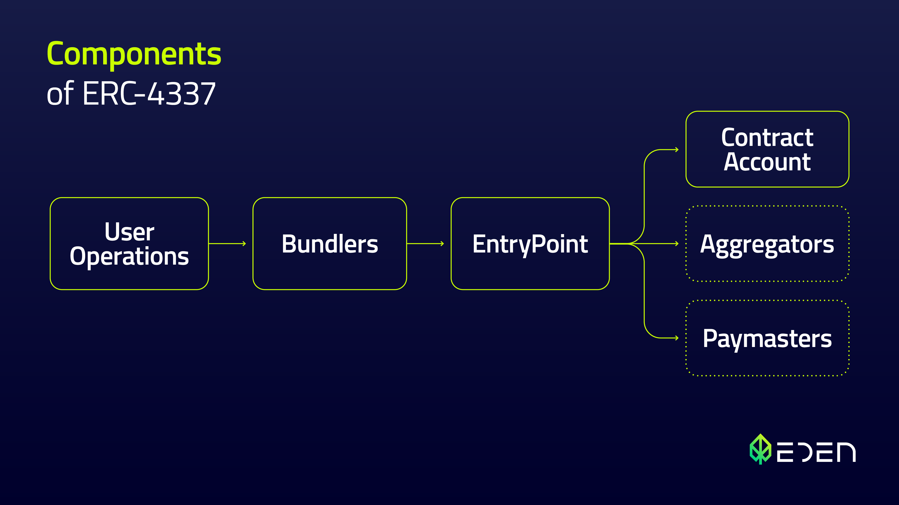
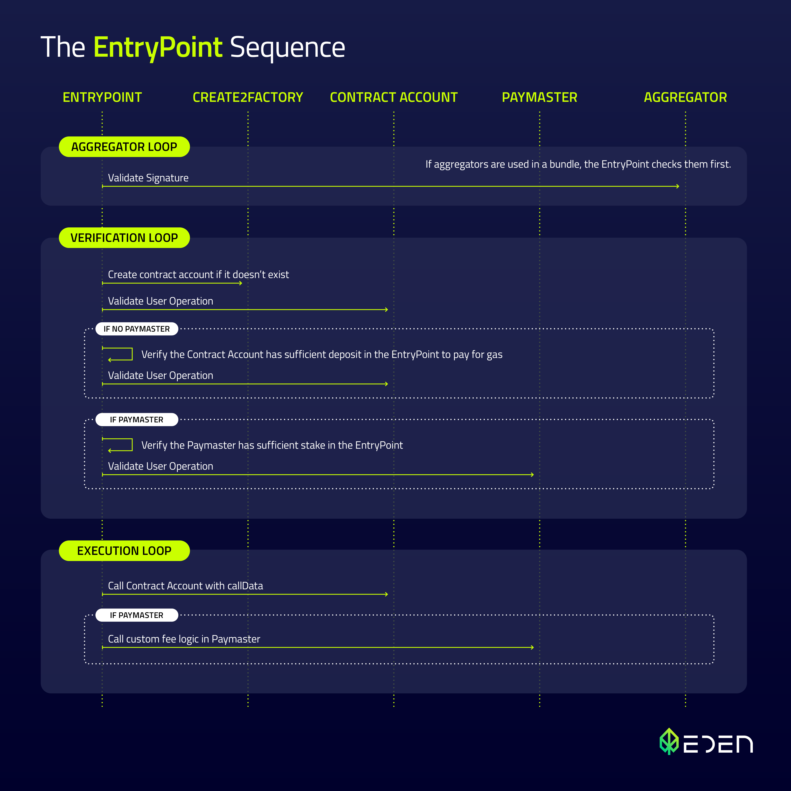
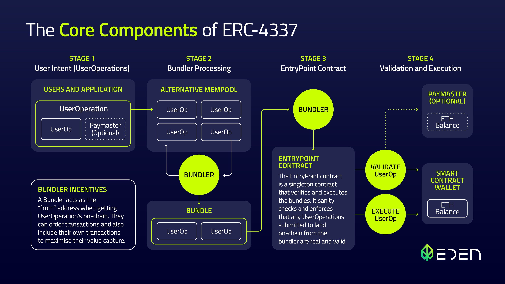

import Diagram from "../../src/components/Diagram";

# ERC-4337 Overview

A quick overview of the standard for developers.

## Introduction

The purpose of this page is to provide developers with a simplified overview of the ERC-4337. 

While the page provides a simplified introduction to account abstraction, it is important to note that for a complete and detailed understanding of the standard, developers should refer to the full [ERC-4337 specification](https://eips.ethereum.org/EIPS/eip-4337).

## Architecture

There are four main components to ERC-4337: a `UserOperation`, `Bundler`, `EntryPoint`, and `Contract Account`. These can be supplemented by `Paymasters` and `Aggregators`.

- **`UserOperations`** are pseudo-transaction objects that are used to execute transactions with contract accounts. These are created by your app.
- **`Bundlers`** are actors that package `UserOperations` from a mempool and send them to the `EntryPoint` contract on the blockchain.
- **`EntryPoint`** is a smart contract that handles the verification and execution logic for transactions.
- **`Contract Accounts`** are smart contract accounts owned by a user.
- **`Paymasters`** are optional smart contract accounts that can sponsor transactions for `Contract Accounts`.
- **`Aggregators`** are optional smart contracts that can validate signatures for `Contract Accounts`.

### UserOperation

A UserOperation captures user’s intent and operations including the sender, payload, and gas-related information. As it was designed to avoid the need for consensus change, the Ethereum team opted to create a completely new structure that captures all required elements of a transaction to be sent on behalf of a user.

To avoid any confusion, they specifically did not label it a “transaction”.

| Field                  | Type      | Description                                                                             |
| ---------------------- | --------- | --------------------------------------------------------------------------------------- |
| `sender`               | `address` | The address of the smart contract account                                               |
| `nonce`                | `uint256` | Anti-replay protection                                                                  |
| `initCode`             | `bytes`   | Code used to deploy the account if not yet on-chain                                     |
| `callData`             | `bytes`   | Data that's passed to the `sender` for execution                                        |
| `callGasLimit`         | `uint256` | Gas limit for execution phase                                                           |
| `verificationGasLimit` | `uint256` | Gas limit for verification phase                                                        |
| `preVerificationGas`   | `uint256` | Gas to compensate the bundler                                                           |
| `maxFeePerGas`         | `uint256` | Similar to EIP-1559 max fee                                                             |
| `maxPriorityFeePerGas` | `uint256` | Similar to EIP-1559 priority fee                                                        |
| `paymasterAndData`     | `bytes`   | `Paymaster Contract` address and any extra data required for verification and execution |
| `signature`            | `bytes`   | Used to validate a `UserOperation` along with the `nonce` during verification           |

### Bundler

A `Bundler` is a class of actors that can do several things:

- Listen in to a `UserOperation` mempool.
- Runs simulations.
- Bundles an array of operations.
- Relays bundles to the `EntryPoint`.

:::note

The dedicated `UserOperation` mempool is separate and not to be confused with the regular transaction mempool.

:::

:::info

Although a public P2P `UserOperation` mempool is still a work in progress, the advantages of account abstraction can still be leveraged today by relying on private mempools that anyone can spin up.

:::

### EntryPoint

The `EntryPoint` is a contract that acts as a central entity for all ERC-4337 accounts and paymasters. It coordinates the verification and execution of a `UserOperation`. For this reason, it's important for all implementations of an `EntryPoint` to be audited and not controllable by any single entity.

The following image and sequence explain how the EntryPoint manages a batch of UserOperations sent by the Bundler. Typically, there are two phases involved, but in the case that the bundle utilizes an aggregator, an additional phase is added.

The EntryPoint sequence is relatively simple and has two real journeys:
- **If there is an aggregator:** Aggregator Loop -> Verification Loop -> Execution Loop
- **If there is not an aggregator:** Verification Loop -> Execution Loop

1. **Aggregator loop**: 
    - If aggregators are used in a bundle, the EntryPoint checks them first. It validates the signature.
2. **Verification loop**: 
    - Checks if a contract account exists. If it doesn’t, it gets created via a [CREATE2 “factory” contract](https://eips.ethereum.org/EIPS/eip-2470).
    - If a Paymaster is not defined: 
        - The sequence verifies if the Contract Account has a sufficient deposit in the EntryPoint to pay for gas. 
        - If it does it then the UserOperation is paid for using this balance and the operation is validated.
    - If the Paymaster is defined: 
        - The sequence verifies if the paymaster has sufficient deposits in the EntryPoint contract. 
            - If it does, the contract then validates the UserOperation.
3. **Execution loop**: 
    - Sends the `callData` in each `UserOperation` to the `Account Contract`.
    - Any unused gas fee is refunded to the `Account Contract` or a function is called on the `Paymaster Contract` to run any required fee logic.
    - If all of the above steps are successful, the operation will be added to the chain

### Contract Account

The `Contract Account` is an end user's account. At minimum it needs to check whether or not it will accept a `UserOperation` during the verification loop.

Additional features to support other account functions like social recovery and multi-operations can be added here too.

### Aggregator

An Aggregator is a special class of actors that utilize a helper smart contract to convert a group of UserOperation signatures into one signature, thereby aggregating them.

### Paymaster

A Paymaster is an optional stakeholder that can sponsor transactions for other users. Why? A Paymaster can be used to enable a number of interesting new features for transacting on Ethereum, for instance:
-	Application developers can easily subsidize fees for their users e.g. as an onboarding/acquisition promotion
-	Users can easily pay gas fees with ERC-20 tokens or off-chain payment methods like credit cards or other subscription services.

## Summary

In the picture below, you can see all components together. If you are interested in a more detailed overview of core components you can get more information in our [article on ERC 4337](https://medium.com/edennetwork/erc-4337-exploring-the-technical-components-of-account-abstraction-part-2-fec300a7f052).

