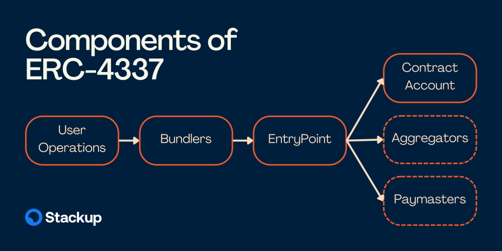
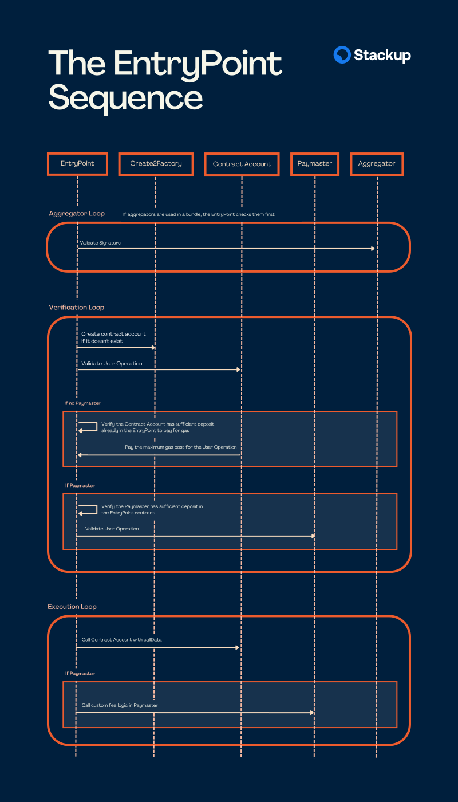
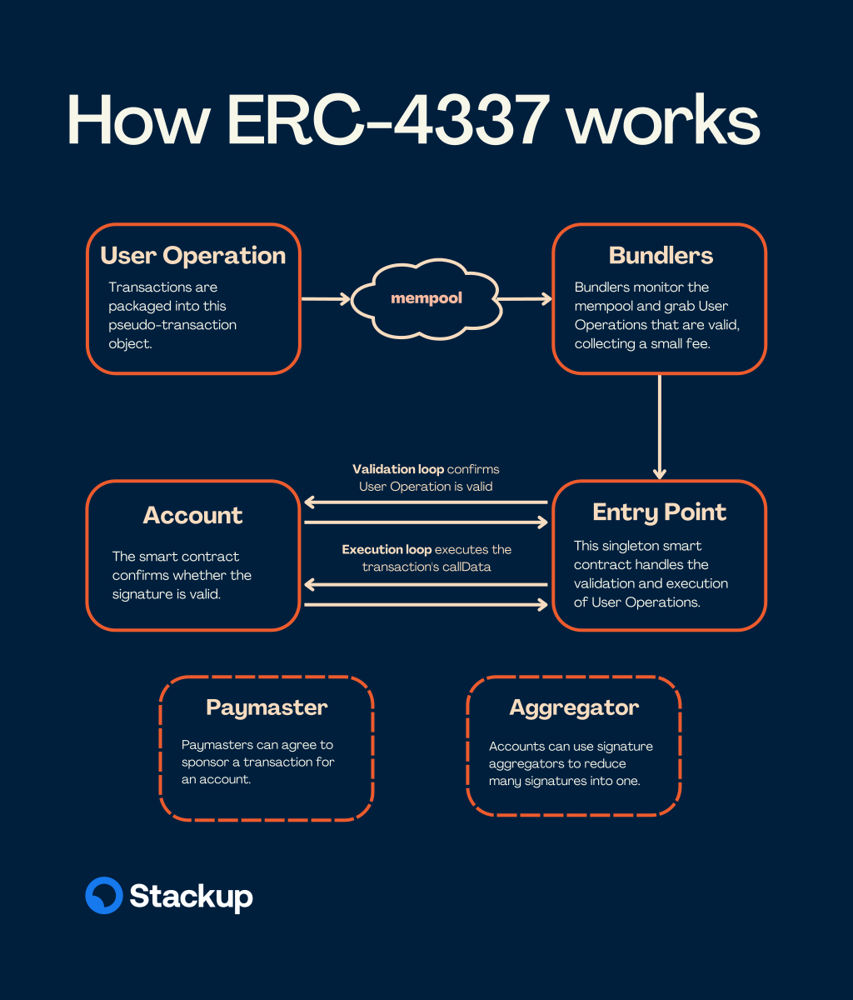

import Diagram from "../../src/components/Diagram";

# ERC-4337 Overview

A quick overview of the standard for developers.

## Introduction

This page gives a simplified overview of ERC-4337 so that developers can get a basic understanding of the different components and how they can be pieced together to build their applications. **For a full run down on the spec we recommend going straight to the [source](https://eips.ethereum.org/EIPS/eip-4337).**

## Architecture

There are four main components to ERC-4337: a `UserOperation`, `Bundler`, `EntryPoint`, and `Contract Account`. These can be supplemented by `Paymasters` and `Aggregators`.

- **`UserOperations`** are pseudo-transaction objects that are used to execute transactions with contract accounts. These are created by your app.
- **`Bundlers`** are actors that package `UserOperations` from a mempool and send them to the `EntryPoint` contract on the blockchain.
- **`EntryPoint`** is a smart contract that handles the verification and execution logic for transactions.
- **`Contract Accounts`** are smart contract accounts owned by a user.
- **`Paymasters`** are optional smart contract accounts that can sponsor transactions for `Contract Accounts`.
- **`Aggregators`** are optional smart contracts that can validate signatures for `Contract Accounts`.

All Stackup tools are EIP-4337 compliant and composable with other open-source packages to make handling this logic easy.

**Recommended ecosystem tools:**

1. **[eth-infinitism client SDK](https://www.npmjs.com/package/@account-abstraction/sdk)** helps you build `UserOperations` in your client.
2. **[eth-infinitism contracts](https://github.com/eth-infinitism/account-abstraction/tree/develop/contracts)** provides a library of ERC-4337 smart contracts for common use cases.

The following sections describe the `UserOperation`, `Bundler`, `EntryPoint`, `Account Contract`, and `Paymaster Contract` in more detail.

### UserOperation

All components of ERC-4337 revolve around a pseudo-transaction object called a `UserOperation` which is **used to execute actions through a smart contract account**. This isn't to be mistaken for a regular transaction type.

| Field                  | Type      | Description                                                                             |
| ---------------------- | --------- | --------------------------------------------------------------------------------------- |
| `sender`               | `address` | The address of the smart contract account                                               |
| `nonce`                | `uint256` | Anti-replay protection                                                                  |
| `initCode`             | `bytes`   | Code used to deploy the account if not yet on-chain                                     |
| `callData`             | `bytes`   | Data that's passed to the `sender` for execution                                        |
| `callGasLimit`         | `uint256` | Gas limit for execution phase                                                           |
| `verificationGasLimit` | `uint256` | Gas limit for verification phase                                                        |
| `preVerificationGas`   | `uint256` | Gas to compensate the bundler                                                           |
| `maxFeePerGas`         | `uint256` | Similar to EIP-1559 max fee                                                             |
| `maxPriorityFeePerGas` | `uint256` | Similar to EIP-1559 priority fee                                                        |
| `paymasterAndData`     | `bytes`   | `Paymaster Contract` address and any extra data required for verification and execution |
| `signature`            | `bytes`   | Used to validate a `UserOperation` along with the `nonce` during verification           |

### Bundler

A `Bundler` is a class of actors that can do several things:

- Listen in to a `UserOperation` mempool.
- Runs simulations.
- Bundles an array of operations.
- Relays bundles to the `EntryPoint`.

:::note

The dedicated `UserOperation` mempool is separate and not to be confused with the regular transaction mempool.

:::

:::info

Although a public P2P `UserOperation` mempool is still a work in progress, the advantages of account abstraction can still be leveraged today by relying on private mempools that anyone can spin up.

:::

### EntryPoint

The `EntryPoint` is a contract that acts as a central entity for all ERC-4337 accounts and paymasters. It coordinates the verification and execution of a `UserOperation`. For this reason, it's important for all implementations of an `EntryPoint` to be audited and not controllable by any single entity.

The above sequence diagram shows how the `EntryPoint` handles a batch of `UserOperations` sent by the `Bundler`. Essentially there are 2 phases.

1. **Verification loop**: Verifies that each `UserOperation` is valid by checking it with both the `Account Contract` and the `Paymaster Contract`.
2. **Execution loop**: Sends the `callData` in each `UserOperation` to the `Account Contract`.

The verification loop will also make sure that either the `Account Contract` or `Paymaster Contract` can pay the maximum gas cost for each `UserOperation`. In the execution loop any unused gas fee is refunded to the `Account Contract` or a function is called on the `Paymaster Contract` to run any required fee logic.

:::info

`Create2Factory` refers to [EIP-2470: Singleton Factory](https://eips.ethereum.org/EIPS/eip-2470). This is a permission-less contract used to deploy `Accounts` with the same deterministic address on any chain.

:::

### Contract Account

The `Contract Account` is an end user's account. At minimum it needs to check whether or not it will accept a `UserOperation` during the verification loop.

Additional features to support other account functions like social recovery and multi-operations can be added here too.

### Aggregator

The `Aggregator` is a smart contract that is trusted to validate signatures for `Contract Accounts`.

### Paymaster

The `Paymaster` is another contract account that handles any `UserOperation` with sponsored transactions. It is required to do 2 things:

1. Check whether or not it will accept a `UserOperation` during the verification loop.
2. Run any required fee logic in the execution loop.

An example of a `Paymaster` logic could be to withdraw a certain amount of ERC-20 tokens from the `Contract Account` after the `UserOperation` is executed. This allows for a UX where users can pay for gas in any currency they choose.

## Summary

Putting it all together:

